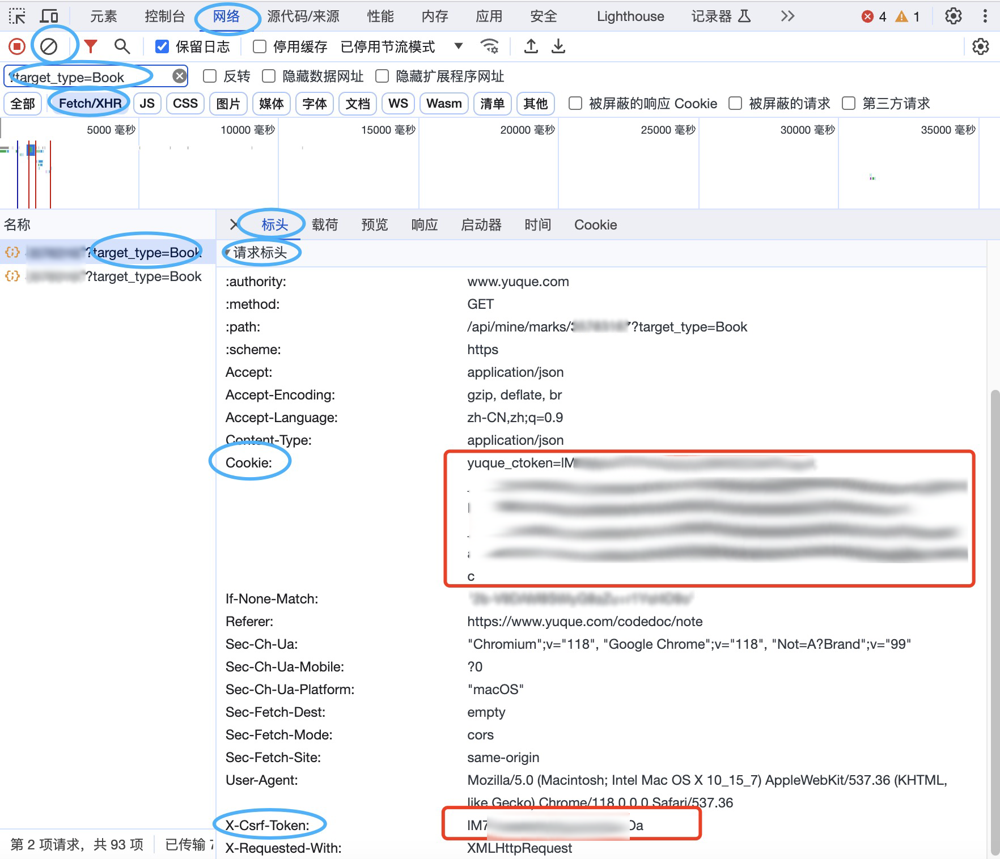

## 功能
    将**语雀**个人知识库按目录结构导出为 markdown 文件（不需要超级会员）。


## 使用方法
1. 安装 Python 运行环境
1. 下载本仓库代码
1. 安装相关依赖
1. 修改 config.py 中的 cookie、x-csrf-token
1. 使用 Python 执行 main.py
```
$ cd yuque-export
$ pip install requests
$ pyhton main.py
```

## 注意事项
1. 不要泄露自己的 cookie 和 x-csrf-token，否则有信息泄露风险！
1. 爬取时间间隔不要设置太小，速度过快存在被封禁风险。
1. 导出时会按照语雀中的目录结构创建相应文件及文件夹，故语雀文件夹名称及文档标题应满足你所使用的操作系统的相关要求。
1. 未验证导出的超长笔记是否完整。


## 如何获取 cookie 和 X-Csrf-Token
1. 登录语雀网页版
1. 打开任意一个知识库
1. F12 打开 控制台
1. 点击控制台顶部菜单中的 “网络” 或 “net” 选项
1. 点击 “清除网络日志” 按钮
1. 点击 “Fetch/XHR” 按钮
1. 刷新当前页面
1. 搜索过滤请求，关键词：?target_type=Book
1. 点击上一步中搜索出的请求
1. 点击 “标头” 或 “Headers”
1. 找到 “请求标头” 或 “Request Headers”
1. 找到 cookie 和 X-Csrf-Token 并复制到 config.py 中

